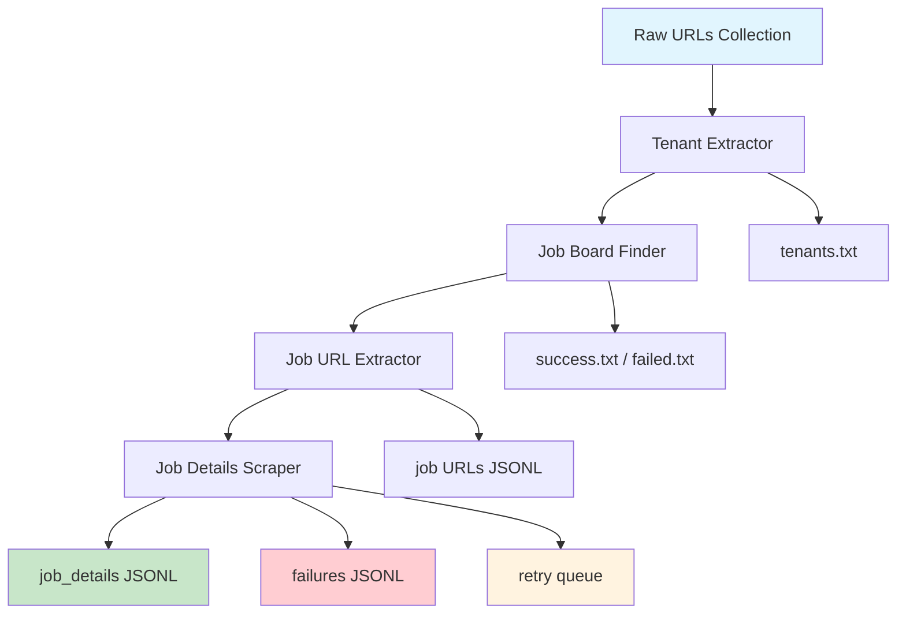

# Avature ATS Scraper

A comprehensive multi-component pipeline for discovering and extracting job postings from Avature Applicant Tracking System (ATS) websites at scale.

## Overview

This project implements an end-to-end solution for scraping job data from companies using Avature ATS platforms. The system intelligently discovers career pages, extracts job URLs using multiple strategies, and processes detailed job information with robust error handling and retry mechanisms.

## System Architecture



**Data Flow:**
1. **Input Processing** → Extract company tenants from URL collection
2. **Discovery** → Validate career page URLs and detect ATS presence  
3. **URL Extraction** → Gather individual job posting URLs using multiple strategies
4. **Content Processing** → Extract structured job data with intelligent error handling

## Core Components

### 📁 [tenant_extractor/](tenant_extractor/)
Extracts unique company tenant names from Avature URLs using regex patterns. Filters test/demo sites and produces clean tenant lists for downstream processing.

### 🔍 [job_board_finder/](job_board_finder/)  
Converts tenant names to valid career page URLs by testing multiple URL patterns. Validates Avature ATS presence and handles redirects with comprehensive failure categorization.

### 🔗 [job_urls_extractor/](job_urls_extractor/)
Extracts individual job posting URLs using three strategies:
- **Sitemap XML** (fastest, most comprehensive)
- **RSS Feeds** (recent posts only)  
- **HTML Pagination** (reliable fallback)

See detailed documentation: [job_urls_extractor/README.md](job_urls_extractor/README.md)

### 📄 [scraper/](scraper/)
Processes individual job URLs to extract structured data (title, description, location, company, etc.). Includes intelligent retry logic and comprehensive output management.

See detailed documentation: [README_JOB_DETAILS_EXTRACTOR.md](README_JOB_DETAILS_EXTRACTOR.md)

## Quick Start

### Prerequisites
```bash
pip install -r requirements.txt
playwright install chromium
```


### Input Formats
- Plain text files (one URL per line)
- JSONL from URL extractor
- Retry files from previous runs

## Key Features Implemented

### ✅ Multi-Strategy Extraction
- Prioritizes fastest methods with reliable fallbacks
- Handles various Avature site configurations
- Adapts to different localization patterns

### ✅ Intelligent Error Handling  
- Separates retryable failures from permanent ones
- Exponential backoff retry strategies
- Comprehensive failure analysis and categorization

### ✅ Scalable Processing
- Concurrent processing with configurable thread pools
- Rate limiting detection and automatic throttling
- Memory-efficient streaming for large datasets

### ✅ Robust Output Management
- JSONL format for streaming and large datasets
- Detailed extraction metadata and performance metrics
- Human-readable summary reports with actionable insights

### ✅ Production-Ready Logging
- Timestamped outputs with structured logging
- Performance statistics and success rates
- Automated retry queue management

### ✅ implemented AWS WAF Token

## Current Limitations & Known Issues

⚠️ **Development Time Constraints (24-hour implementation)**

### 🔍 Site Discovery Limitations
- **Limited to existing URL collection** - No automated discovery of additional Avature-hosted sites
- **Missing search engine discovery** - Could implement Google/Bing searches for `site:*.avature.net` to find more companies
- **No competitive intelligence** - Missing discovery through job board aggregators and industry directories

### 🎯 Extraction Coverage Issues  
- **Partial field extraction** - Not all sites have complete data extraction implemented
- **Site-specific optimization** - Only **Bloomberg** and **UCLA Health** have fully optimized field extraction
- **Variable data quality** - Other sites may have missing or incorrectly mapped fields
- **No universal field mapping** - Each Avature implementation uses different HTML structures

### 🔐 Authentication & Access Limitations
- **Missing AWS token generation for scraping indivual job descriptions** - Some Avature sites require AWS authentication tokens for API access
- **No OAuth implementation** - Sites with OAuth-protected endpoints cannot be accessed
- **Session management** - No handling of sites requiring login sessions or CSRF tokens
- **Rate limiting bypass** - Missing sophisticated authentication to avoid API rate limits

### 📊 Validated Extraction Quality
✅ **Fully tested and optimized: (mostly because I wrote hybrid_scraper.py for these 2 as I was still explorating the sites)**
- [Bloomberg](html_examples/bloomberg.html) - Complete job data extraction
- [UCLA Health](html_examples/uclahealth.html) - Full field mapping verified

⚠️ **Partial/untested extraction:**
- Most other Avature sites - Basic extraction only
- Field completion rates vary significantly by site

## What's Missing / Future Enhancements

## Technical Decisions & Architecture Notes

### Why Multi-Strategy Extraction?
Different Avature sites expose job data through different mechanisms. The tiered approach ensures maximum coverage while optimizing for performance.

### Why JSONL Output Format?
Enables streaming processing of large datasets and easy integration with data processing pipelines while maintaining human readability.

### Why Separate Retry Logic?
Distinguishes between transient issues (network timeouts) and permanent failures (404 errors) to optimize resource usage and success rates.

## Output Structure

```
├── job_details/           # Successful extractions
├── failures/             # Permanent failures  
├── retries/              # Retryable failures
└── logs/                 # Processing statistics
```

## Performance Statistics


---


